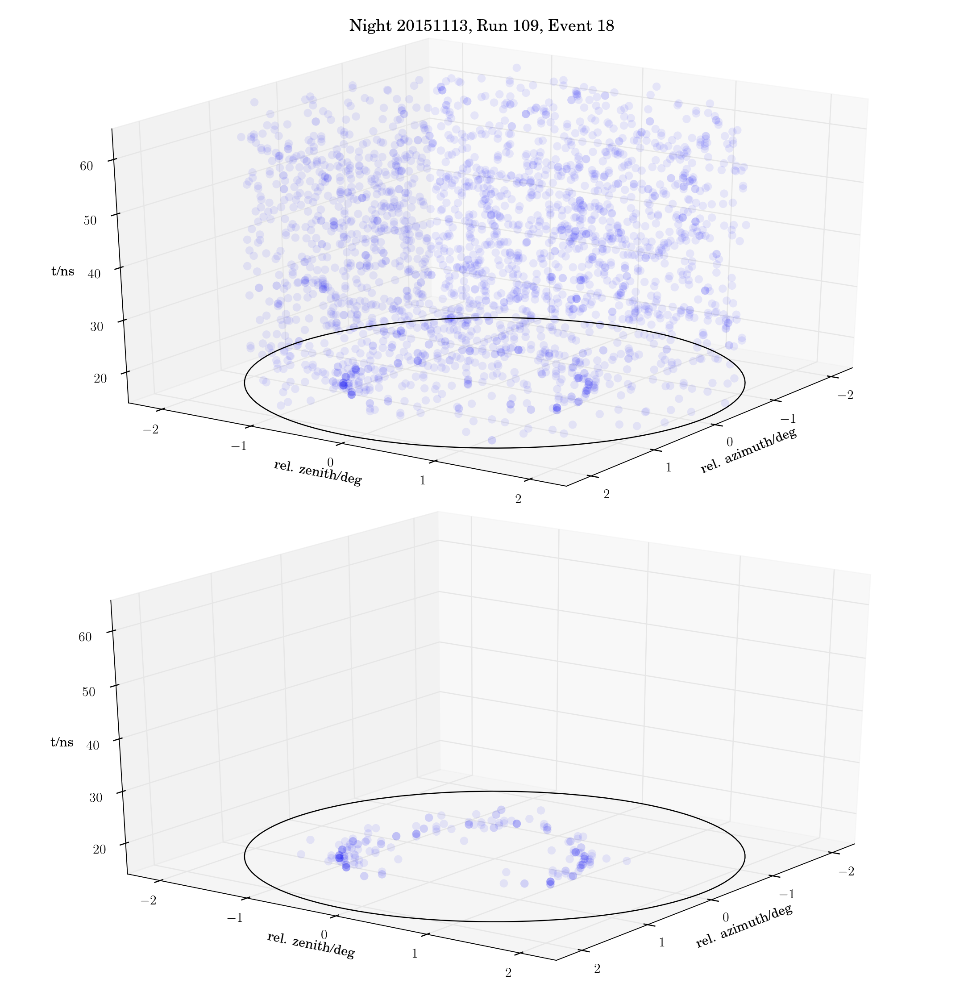

# Muons[](https://travis-ci.org/fact-project/muons)

### Install

````
pip install -r requirements.txt
pip install .
````



A collection of tools to recognize, extract and plot the FACT muon events, extracted from the photon-stream.

### Recognize muon events

The process of recognition is divided into 6 parts:


    1) Photons are tested if they belong to a cluster. Photons that do not belong to the cluster are given label -1. Photons that belong to a cluster are given the label (0,....,n) depending on the cluster number they belong to.    
    2) The number of photons is the sum of all the photons for which the cluster number is >=0.
    3) In order to find muon-like events ransac (RANdom SAmple Consensus) for a circle model is run.
    4) Using ransac parameters (e.g. cx, cy, r, ..) of the best fit are found. If the radius of muon ring is not between the set values then the event is disregarded.
    5) Another example of further requirement for the event to be regarded as a muon-like is that the muon ring should be populated evenly
    6) If all the requirements are fulfilled, the event is regarded as a muon-like event.

### Extract features of muon events

The training sample for a muon-like event recognition is done by hand by Sebastian Müller and Max Nöthe.

### The muon sample
A list of the FACT event IDs for 13.78 millon events which are muon like.
