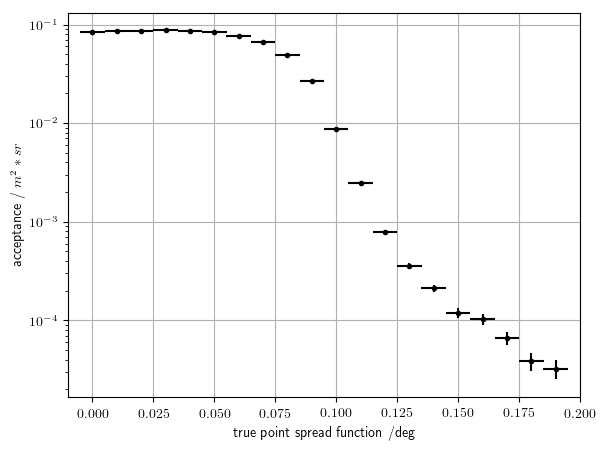
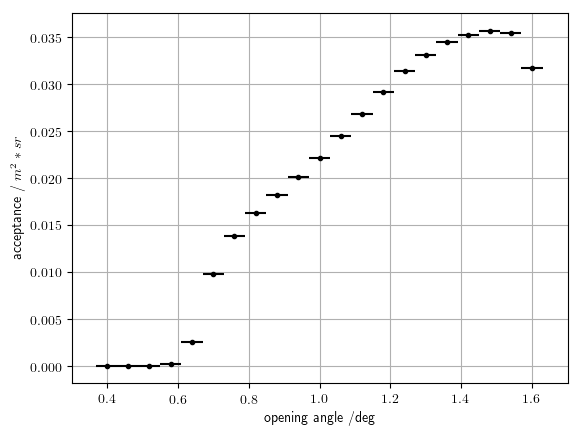

# Detection 

The process of recognizing muon events:

* Finding Cherenkov clusters using DBScan. Each cluster is given a label (0, ..., n), photons with label -1 are night-sky-background photons.

* Projecting clusters onto a 2D plane and using [Circle Model](https://scikit-image.org/docs/dev/api/skimage.measure.html#skimage.measure.CircleModel) wrapped with [RANSAC](https://scikit-image.org/docs/dev/api/skimage.measure.html#skimage.measure.ransac) to find best ring fit for given event

* In order to improve accuracy and get rid of the bias, the ring parameters found by Circle Model are used as an initial guess for [Circle Hough Transformation](https://github.com/Laurits7/circlehough).

* Having found best parametrization for the ring, cuts are made to classify events to be either muon-like or not.

Cut parameters:

| parameter | value |
---------| -----------
| number-of-photons-min | 3 |
| muon-ring-radius-min | 0.45 deg |
| muon-ring-radius-max | 1.6 deg |
| muon-ring-overlapp-with-field-of-view-min | 20 % |
| arrival-time-stddev-max | 5e-9 s |
| initial-circle-model-photon-ratio-min | 0.6 |
| visible-ring-circumference-min | 1.5 deg |
| off-density | 0 |
| on-off-ratio-min | 3.5 |
| density-circle-model-inner-ratio-max | 0.25 |
| evenly-populated | True |

# Results

With this classification the following results were achieved:

Precision = 99.3%
Sensitivity = 67.2%

Where:
[img](README/precision.pdf)
and
[img](README/sensitivity.pdf)

## Acceptance vs point-spread-function

As we can see from the following figure, then with increasing opening angle the acceptance is decreasing because of increasing difficulty to classify muon events. 

## Acceptance vs opening-angle

Furthermore we see from the following how acceptance is increasing with increasing opening angle

