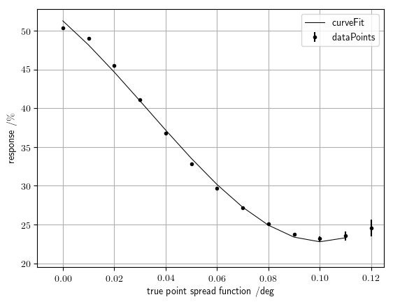

# Point-spread-function monitoring

Observed fuzziness of the muon ring is used as a measure to infer the point-spread-function (PSF). As the fuzziness parameter, Hough response was found to be the best to infer the PSF. Hough response is the normed maximum bin value from the Hough accumulator that is filled by [Circle Hough](https://github.com/Laurits7/circlehough).

## Hough response

Found hough response dependence on point spread function is:

Using a function of third degree polynomial we fit the dependence up to 0.1 degrees. We use a 3rd degree polynomial because saturation due to pixellation **[^1]** is expected in the very lowest regime and unknown behavior is expected when the point spread function is bigger than one pixel.

Function fitted is: 

**[^1]** B. Kamgar-Parsi and W. Sander, "Quantization error in spatial sampling: comparison between square and hexagonal pixels," in *Computer Vision and Pattern Recognition, 1989. Proceedings CVPR'89., IEEE Computer Society Conference on, pp. 604-611, IEEE, 1989*

# Point spread function vs time

Using Hough response to reconstruct point-spread-function over time, we get the following figure:

Values for each point on the figure can be found in [psf\_vs\_time.csv](/readme/psf_vs_time.csv)

